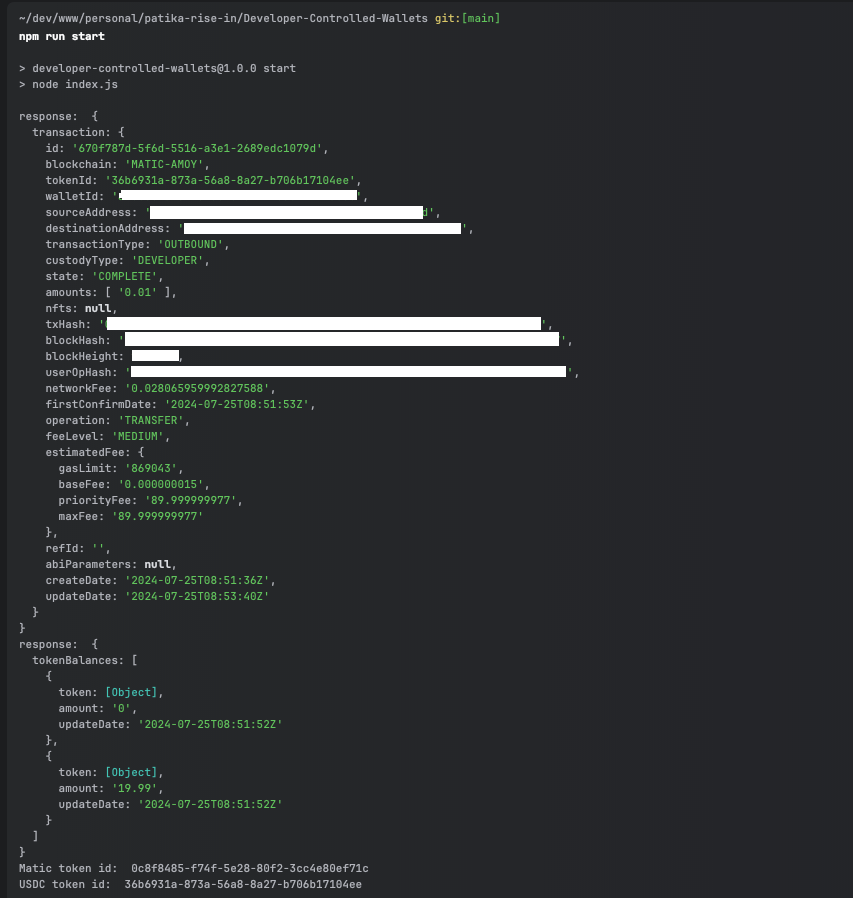

# Developer Contolled Wallets

Welcome to the `developer controlled wallets` section which is a follow up tutorial from the [previous one](https://github.com/SimonYuvarlak/Gas-Station.git)

In this section of the course, you will learn how to craete user controlled wallets. To be honest, I like this part much more.

## How to Use this Repository

If you have followed the previous ones repositories than you are aware that there are separate tutorial markdown files in those ones. In this one, there is just two js files. One for implementing the functions from sdk and the other one is to run it (index.js).

You will find the necessary information in this README.md file and index.js file commented out.

First of all, for this project, you need to create .env file with the following variables:

- `API_KEY`=
- `ENTITY_SECRET`=
- `WALLET_SET_ID`=
- `WALLET_ID_1`=
- `WALLET_ID_2`=
- `WALLET_ADDRESS_1`=
- `WALLET_ADDRESS_2`=
- `USDC_TOKEN_ID`=

Start with adding the `API_KEY`.
You will fill the rest once you have obtained the data from the Circle API.

You will comment out the code in the `index.js` file step by step since you will need to obtain data and modify the .env file.

There are `2 main sections` and `9 steps` in total.
The first section is about `generating a random secret and a ciphertext`.
The second section is about `creating a wallet`, `getting wallet information`, `making` and
`confirming a transactions`, and `checking the wallet balance`.

The developer controlled wallets are not like user controlled wallets meaning that `you do not
need to present a challenge to the user to finalize the transaction`.

You can see the implementation of the function in the `helper_functions.js` file.

## Running the Project

To run the project, first install the dependencies:
`npm install`

Then run the project:
`node index.js`
or
`npm run start`

## Important Note 1

After you have obtained `entity secret` and `ciphertext`, make sure to save them.
Additionally, you will add the `entity secret` to your `.env` file as discussed above.

After you saved these information in a safe place go to the [circle website](https://console.circle.com/wallets/dev/configurator)

This site will take you to configurator page under Dev Controlled dropdown.

_Paste your ciphertext here and save the .dat file that will be given to you._

If you lose the `ciphertext` and the `.dat recovery file`, you will not be able to access the wallets.

Once this process is safely done, you can continue to the project.

## Important Note 2

Before step 6 (listing the wallet transactions by calling `wallet_transactions()`), go to the [faucet website](https://faucet.circle.com/) and get some test tokens for the `WALLET_ADDRESS_1`. Do not worry, you will acquire the address before this step. You are making this simply because this acquisation of test tokens will be the transaction that you will be checking.

**As usual, you will find a TASK.md file**

